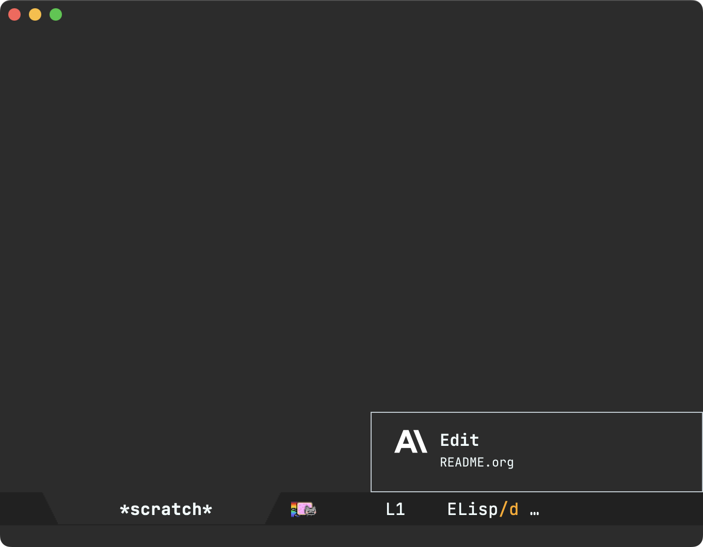

#+TITLE: agent-shell-knockknock

👉 [[https://github.com/sponsors/xenodium][Support this work via GitHub Sponsors]] by [[https://github.com/xenodium][@xenodium]] (check out my [[https://xenodium.com][blog]])

Get [[https://github.com/konrad1977/knockknock][knockknock]] [[https://github.com/xenodium/agent-shell-knockknock/tree/main][agent-shell]] notifications when your attention is elsewhere.

* Requirements

- [[https://github.com/xenodium/agent-shell][agent-shell]]
- [[https://github.com/konrad1977/knockknock][knockknock]]

* Install / setup

#+begin_src emacs-lisp
  (use-package agent-shell-knockknock
    :after (agent-shell knockknock)
    :hook (agent-shell-mode . agent-shell-knockknock-mode))
#+end_src
